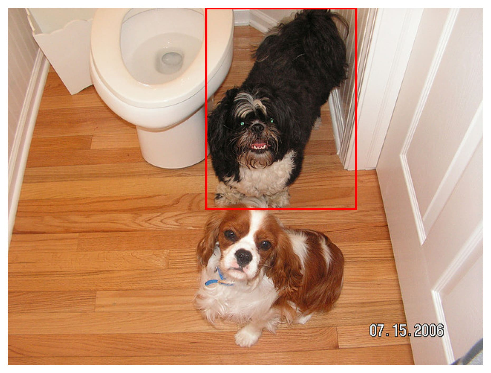
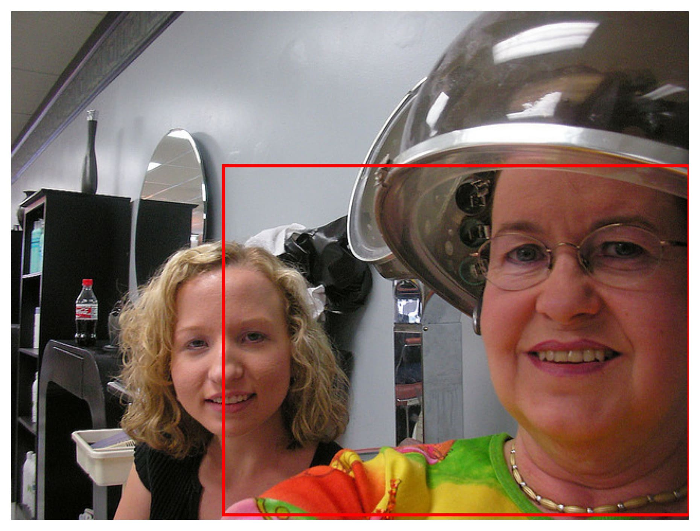
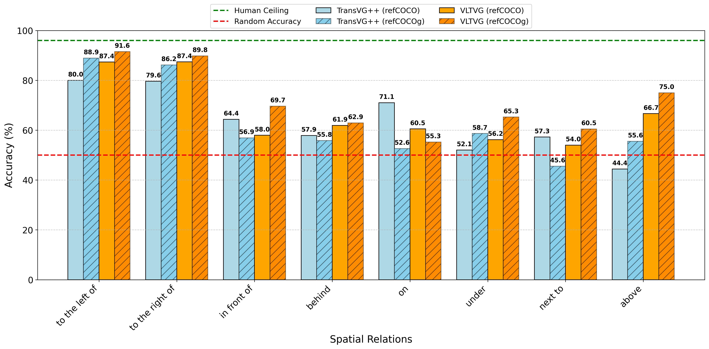
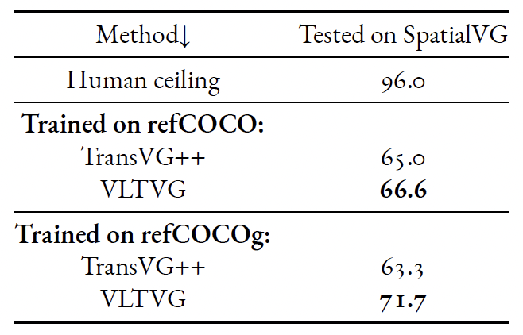

 

  <h1 align="center">Exploring the Role of Spatial Relations in Visual Grounding: A Novel Benchmark and Synthetic Pretraining </h1>
  <h3 align="center">Benchmarking spatial reasoning in visual grounding.</h3>

### Overview

We are proud to introduce Spatial Visual Grounding (SpatialVG), a novel benchmark specifically designed to evaluate the spatial reasoning capabilities of modern visual grounding models.
SpatialVG images are carefully curated to contain two instances of the same object category,
which require disambiguation using a referring expression, aligning with the task requirements
of visual grounding. Unlike prior benchmarks, the referring expressions in SpatialVG are generated using a template-based approach. Each expression includes a single spatial relation that distinguishes the target object (one of the two instances) from the other, by relating it to a third, single-instance object that serves as a spatial reference. This structure allows us to probe models’ability to differentiate between similar objects based on relative spatial relationships to a third entity, effectively testing their spatial reasoning skills in a controlled context. Some examples are shown below.

_The dog next to the toilet_   |  _The person under the hairdryer_ | _The cat in front of the person_
:-------------------------:|:-------------------------:|:-------------------------:
  |   |   

#### Why SpatialVG?
Spatial reasoning is an essential part of human cognitive functions, underpinning the ability
to describe, understand, and interact with the environment. Natural language inherently contains
spatial relations, which are frequently used to locate objects relative to each other, such as
“above,” “to the left of,” or “behind.” These relational descriptors are critical to tasks ranging from navigation to object manipulation and are deeply embedded in everyday communication,
as people rely on spatial cues to describe scenes or guide actions. Given it importance we wanted to study it under the lens of visual grounding.

#### Discoveries
The by-relation accuracy of TransVG++ [(Deng et al., 2023)](https://doi.org/10.1109/TPAMI.2023.3296823) and VLTVG [(Yang et al., 2022)](https://doi.org/10.1109/CVPR52688.2022.00928) models trained on refCOCO/refCOCOg and evaluated on SpatialVG is shown below.

Models struggle with spatial relations requiring 3D implicit reasoning (in front of and behind), vertical positioning (on, above and under) and proximity (next to). Horizontal relations (left, right) seem to be better understood, reaching significantly higher accuracy.

 

**_Poor overall performance_.** The top-performing model is VLTVG trained on refCOCOg, with an overall accuracy score of 71.7%. Compared to the human ceiling, there is more than **24% gap**, meaning that there is plenty of room for improving spatial reasoning in visual grounding.